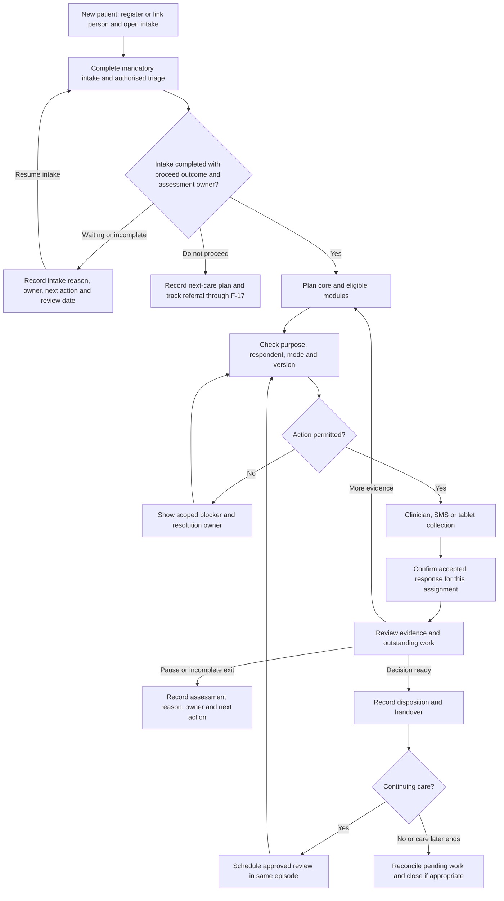
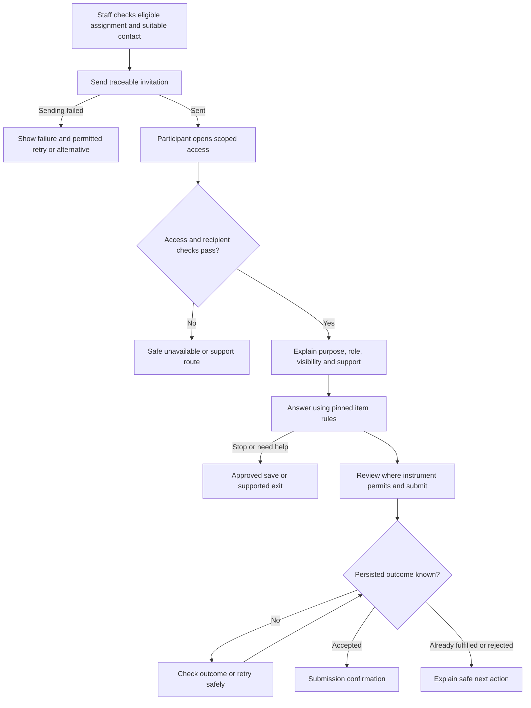

# YSCC Platform — User flows

Version 0.3 · 15 September 2026 · Baseline flows and persona-derived candidate flows  
[Document index](README.md) · [Requirements and logic](05-requirements-and-logic.md) · [Screen inventory and IA](08-information-architecture.md)

## 1. Reading the flows

These are proposed interaction specifications, not implemented screens or approved clinical pathways. F-01–F-11 and F-17 describe the baseline; F-12 is conditional; F-13–F-16 cover the broader CMDCS persona needs as candidate scope. L-xx rules and open D-xx decisions govern the branches. Use synthetic data and labelled sample policies until decisions are approved.

ST IDs are staff surfaces, PT IDs are scoped participant surfaces, and EX IDs are candidate expansion surfaces. An ID describes a logical screen/view, not a prescribed URL or separate engineering component. Every access and mutation requires server-side authorisation; hiding an action is not enforcement.

## 2. Primary care flow

The diagram's collection node includes draft, failure, and cancellation outcomes detailed below; it does not imply every started task reaches submission. Permission checks are repeated at each relevant action, including dispatch and submission.

## 3. F-01 — Register, complete mandatory intake, then plan assessment

**Actors:** Authorised registration/intake staff and triage reviewer; Jess/P-04 and the Assessment Team take the clinical handoff. Tom/P-06 registers only with that capability. Exact Engagement Team assignments remain D-26.  
**Entry:** ST-01 My work → intake queue, or ST-02 People → New person; staff sign in through ST-00 if needed.

1. Search/match within permitted scope. Confirm the existing person or register the new person with the supplied information. A possible duplicate goes to F-07; no match is not proof of no previous record. After an uncertain save, check its outcome before retrying.
2. **Every new patient opens ST-27 Intake.** Save the linked person/intake, source, received time and accountable owner. A new registration creates no automatic core assessment or ongoing-care assignment.
3. Complete the registration/intake fields in requirements section 7: identity/matching, suitable contact or alternative, referral/self-contact context, communication/support needs and applicable purpose/authority checks. Save missing/unknown values explicitly; block progression on unresolved required checks.
4. Use Received → In progress → Awaiting information / Awaiting triage / Waiting as appropriate. Each unresolved state shows reason, owner, next action and next review date. Information arrival resumes the owned task. Intake and approved support remain available while the assessment gate is blocked.
5. The authorised reviewer records the required checks, outcome, reason and decision time. Completed + proceed + receiving assessment owner permits the next step. Completed + do not proceed → explained next-care plan and F-17 if an onward referral is needed. An unfinished exit → closed incomplete with reason and follow-up; neither is admission.
6. Resolve/select the episode under L-01/D-09 before core-assessment planning; retain the intake's identity and actual history. ST-04 displays intake outcome, episode/owner and next step. Receipt of a referral never fabricates an admission date or episode boundary.
7. Proceed to ST-05 only after the L-27 gate passes. Plan the approved shared core and conditional modules, pin versions and continue F-02. All direct creation/activation paths recheck the gate. Waiting for assessment after intake completion remains downstream owned work.

**Existing-care variant:** Open the existing episode and continue its approved plan/reviews. Do not require new-patient intake for a repeated measure. Returning/transferred patients use the authorised episode/intake determination with evidence; record existence is not a blanket bypass.

**Outcome:** Completed/proceed intake linked to an owned assessment plan, or an explicit owned wait/non-proceed/incomplete path with referral follow-through where relevant.  
**Rules/tests:** L-01–L-04, L-07, L-15, L-17, L-24, L-27–L-29; AC-01, AC-06, AC-09, AC-23–AC-29. D-25 confirms mandatory intake; D-26/D-27 specify remaining details.

## 4. F-02 — Set up collection and clinician entry

**Actor:** Jess/P-04; facilitator capabilities are limited to approved setup tasks.  
**Entry:** An assignment in ST-05 or ST-09.

1. Open ST-06 Assignment setup. Confirm the person/episode, instrument/version, collection point, respondent, recorder, assistance/joint mode, owner, and due window if applicable.
2. Check current purpose/authority/visibility in ST-11 as needed. Missing requirement → explain permitted blocker and owner; return to setup after resolution. Do not block unrelated purposes.
3. Select an eligible delivery mode. SMS → ST-08 then F-03. Tablet → ST-08 then F-04. Clinician entry → ST-07.
4. In ST-07, identify clinician rating versus transcribed respondent answer versus approved joint completion. Validate the pinned item rules and keep that provenance visible.
5. Save draft or continue answering. Back/navigation preserves confirmed drafts under policy and warns about unsaved changes; no unsupported offline guarantee.
6. Submit → validate/current-authority check → saving state → confirmed response and fulfilled assignment. Save failure/uncertainty → recovery without false success or duplicate fulfilment.
7. Return to ST-05/ST-09 with remaining work visible; choose next assignment or clinical review F-05.

**Outcome:** This assignment is fulfilled or retains its actual incomplete state; the full assessment is not automatically complete.  
**Rules/tests:** L-03–L-11; AC-01, AC-02, AC-04, AC-10, AC-13, AC-15–AC-17.

## 5. F-03 — SMS self-report, including family contribution

**Actors:** Kai/P-01 or Deb/P-02; authorised staff manage invitation.  
**Entry:** Staff ST-08; participant PT-01 through an expiring account-free link.

Detailed sequence:

1. ST-08 confirms recipient suitability, current permission, approved verification, expiry, content/template, and assignment version. “Send” creates an attempt; “sent” is not proof of receipt.
2. PT-01 validates access and applies approved recipient checks. Wrong recipient, invalid/expired/revoked link, disallowed context, or already completed → PT-06 with only safely disclosable information and PT-07 support.
3. PT-02 introduction explains request, respondent role, purpose, visibility, support, expected effort when known, and save/expiry behaviour. No account setup is inserted into this reported channel.
4. PT-03 displays the pinned questions. Use approved skipping/nonresponse and assistance rules. Back retains allowed work; changing answers or review visibility must respect instrument rules.
5. PT-04 provides pre-submit review if the instrument permits it; otherwise the approved final-submit step provides clear confirmation of intent without an unauthorised answer-review mode.
6. On submit, use L-11. PT-05 appears only after accepted persistence. Confirm which task was received and the approved next step; do not present unapproved clinical interpretation or claim live monitoring.
7. ST-09 reflects fulfilment and actual response date. Ordinary reminders stop for this assignment; other work/review remains independent.

**Recovery branches:** Expired link + saved draft → request/reissue under approved rules; preserve attempt history and explicit draft disposition. Repeat click/network retry → resolve existing operation. Competing attempt → explicit already-submitted/conflict outcome, never merged answers. Unsuitable contact → another eligible mode or staff follow-up.

**Family variant:** Deb receives her own eligible task and role wording. Do not prefill Kai's answers or infer guardian authority. Satisfaction content is enabled only if FR-15 is adopted. D-21 preserves the PDF/Slack launch-phase conflict.

**Rules/tests:** L-03–L-13, L-24; AC-02, AC-08, AC-10–AC-11, AC-15–AC-17, AC-22.

## 6. F-04 — Tablet handover and reset

**Actors:** Kai/Deb, with Jess or a permitted P-05 facilitator.  
**Entry:** ST-08 on the clinic device.

1. Staff confirm the right person/episode/assignment, permissions, instrument eligibility, and assistance context. Launch a temporary participant session.
2. PT-01 → PT-02 isolates participant context and explains visibility/support. The participant must not see a staff sidebar, person search, previous answers, or unrelated tasks.
3. PT-03 → PT-04 where permitted → submit. Record whether completion was independent, assisted, joint, or transcribed according to what actually happened.
4. Confirm accepted receipt at PT-05, then end participant context and show PT-09 neutral reset. Provide enough confirmation to avoid confusion without leaving answer content exposed.
5. Staff re-authenticate and pass authorisation before returning to ST-09 to check receipt; the participant session itself cannot reopen staff work.

| Interruption | Required interaction |
| --- | --- |
| Cancel/stop | Explain saved/unsaved consequences allowed by policy, end session, clear local context, show PT-09. |
| Timeout | Approved warning/extension where permitted; on expiry clear local context. Saved server draft retention/resume is a separate rule. |
| Failed save | Show unresolved save with safe retry; do not clear recoverable work as though it was submitted. If session must end, follow the approved security/draft policy. |
| Back after reset | Remain neutral or require fresh authorised access; never redisplay prior answers or staff workspace. |
| New participant | Staff launch a new eligible session; no prior-person context carries across. |

**Rules/tests:** L-03, L-07, L-09–L-11; AC-03, AC-04, AC-11, AC-16. Session duration/storage decisions remain D-18.

## 7. F-05 — Clinical review, disposition, and handover

**Actor:** Jess/P-04 with approved clinical capabilities.  
**Entry:** ST-05 or ST-09 → ST-10 Review.

1. Confirm episode/assessment and inspect submitted evidence, source/version, and outstanding assignments. Link to ST-13 for history and ST-17 for permitted correction context.
2. Additional evidence required → add an eligible module with reason in ST-05 and repeat F-02. Reviewing partial evidence does not complete the assessment.
3. Record review identifying evidence/revision and date. Evaluate the approved completion criteria separately.
4. Pause or close incomplete → ST-12 with reason/owner/next action; preserve partial evidence and reconcile outreach. No automatic recurring collection.
5. Ready disposition → ST-12. Record admitted/not admitted/undecided as approved, separate referral destination/action, and dated team/stream allocation.
6. Any onward referral → F-17 for actual sending, receiving decision and handover follow-through, including external steps. Continuing care → confirm next team/owner/plan, then F-08. Not continuing → record next care step and F-09 if episode closes. Transfer follows approved episode/access rules.

**Rules/tests:** L-14–L-18, L-23–L-24; AC-02, AC-07, AC-09, AC-12, AC-14. A clinical decision is not inferred from a computed score or completed form.

## 8. F-06 — Correct from evidence or request clinician input

**Actors:** Jess/P-04 (Clinician), Ananya/P-07 (Data Manager), or Tom/P-06 (Data Officer under the verified-source rule).  
**Entry:** ST-14 correction queue, or ST-10 through “Review responses” / “Review recorded” → “Edit responses.” Collection “View details” is for metadata and delivery information; response editing and its history belong in the review view.

1. ST-16 shows target record/field, current revision, prior value, source/respondent/recorder, and prior corrections.
2. Evaluate capability and scope. Clinician or Data Manager → “Edit responses” for a submitted response, including previously reviewed responses. Tom has an approved corroborating external source → “Correct from verified source.” No such source → “Request clinician correction,” with issue/context/owner and permitted evidence reference.
3. Direct correction requires new value, reason, relevant source/reference, and a before/after review. Cancel leaves the record unchanged.
4. Commit checks current record revision. Concurrent change → show updated context and require review, not overwrite.
5. Save each changed item together with its append-only log: response/item and revision, prior/new value, editor identity/role, timestamp, reason, and relevant source. Confirm correction and return to the review view with ST-17 response edit history. The original answers and respondent/recorder remain available; the response stays submitted. Flag affected reviewed evidence for re-review while retaining earlier reviews. Scoring/re-review follows D-13; no new invitation or ordinary reminder. Cancel or an unchanged edit leaves the record untouched.
6. For a request, ST-14 shows responsible clinician and next action. A request is not itself a correction; the authorised clinician's eventual action closes the loop with evidence.

**Rules/tests:** L-20, L-24; AC-05, AC-18. Exact correction-source systems/fields and approval requirements remain D-13.

## 9. F-07 — Duplicate or misaligned record resolution

**Actor:** Ananya/P-07 within approved scope, with required centre support.  
**Entry:** ST-15 from ST-02/ST-14 or an authorised issue.

1. Open a resolution case; compare candidate identifiers, source links, ownership, evidence, and affected dependent records.
2. Uncertain identity/insufficient authority → assign investigation/escalation; do not offer an automatic merge as the next default.
3. Record required centre support and approval under D-14. Preview the proposed resolution and its record/access impact.
4. Perform only an authorised recoverable action; verify resulting links and audit in ST-17. Failure → keep a clear unresolved case, not an assumed successful resolution.
5. Provide the approved recovery procedure and communicate the resulting work item to its responsible actor. Do not infer authority to send external messages from this screen specification.

**Rules/tests:** L-01, L-21, L-24; FR-31–FR-34. Exact merge/link/undo mechanics remain an implementation/governance decision.

## 10. F-08 — Plan and complete a later review

**Actors:** Jess and authorised scheduling/operations capabilities.  
**Entry:** Continuing-care plan in ST-04/ST-09 after F-05.

1. Confirm episode remains appropriate for continuing care; select approved instrument/cadence/anchor/window at ST-06.
2. Create a distinct collection point and pinned assignment, keeping the same episode. Do not overwrite baseline or use “90 days elapsed” as an episode boundary.
3. Confirm purpose/respondent/channel through F-02, then F-03/F-04 or clinician entry. Dispatch/reminders recheck current conditions.
4. Due/overdue is derived for active outstanding work. Expired link → recovery; fulfilled assignment → no ordinary reminders; late/missed collection → approved scheduling rule, not a guessed new anchor.
5. Review response/trends at ST-10/ST-13, retaining source/version/comparability limits. Record next plan or move to F-09.

**Rules/tests:** L-13, L-16, L-22–L-23; AC-07, AC-11–AC-12. Monthly collection requires D-08 approval.

## 11. F-09 — Pause, transfer, or close an episode

**Actor:** Authorised clinical/operations staff.  
**Entry:** ST-12 from the selected episode, not a generic global action.

1. Choose the specific action: pause work, transfer ownership, close assessment incomplete, or close episode. Explain the scope; these actions are not synonyms.
2. Record applicable reason, effective date, owner/receiving team, next care action, and disposition where relevant.
3. Inspect pending assignments, drafts, links, reminders, reviews and onward referrals. An unresolved referral retains its follow-up owner; closure does not imply acceptance. For each applicable category, apply and record the approved treatment under D-11.
4. Confirm the impact; cancel returns unchanged. On commit, enforce authority and reconcile affected work.
5. Only show success once the required state/reconciliation is confirmed. Partial failure → explicit unresolved action, owner, and recovery; no false fully-successful closure.
6. ST-04 reflects actual episode/task states. Historical records remain accessible only within authorised scope/retention. Any post-closure activity is intentional and approved.

**Rules/tests:** L-17–L-19, L-24; AC-09, AC-14, AC-21. Detailed discharge content is separate conditional scope.

## 12. F-10 — Purpose decision, authority, and withdrawal

**Actors:** Kai, an authorised P-03 guardian where applicable, and permitted staff.  
**Entry:** ST-11; PT-08 only if the approved policy includes a digital decision surface.

1. Identify the particular purpose/action and current information version. Check who can make the decision and what evidence establishes authority.
2. Explain choices, visibility, consequences, and support using approved wording. Uncertain authority → named review route, not invented age/relationship logic.
3. Record decision/status, person/scope, decision-maker/authority, and effective time. If digital collection is not approved, staff use the approved recording pathway; do not invent a guardian account.
4. Withdrawal/change → show the policy-defined affected actions and apply the relevant access/contact/use rules. Unrelated purposes remain separate.
5. Record history and pending-work reconciliation. Retention/disposal follows its approved process, not an automatic all-data deletion or indefinite-preservation assumption.

**Rules/tests:** L-07–L-09, L-19; AC-08, AC-10, AC-17. D-04–D-06/D-11 determine production behaviour.

## 13. F-11 — Configure and publish approved changes

**Actors:** P-09 and distinct clinical/content/governance approvers where required.  
**Entry:** ST-18 → appropriate ST-19–ST-23 configuration area.

1. Open current version and approved change request/rationale; confirm edit versus approval/publication capability.
2. Create a draft change to the instrument, roles/scopes, rules/cadence, purpose policy, or messages. Show effective dates and dependencies.
3. Preview/test with synthetic records, including active old-version assignments and blocked/error scenarios. Failed validation returns to the draft with specific issues.
4. Obtain required approval; publication checks current authority and dependencies. Unapproved/failed publication is not active configuration.
5. Confirm published version/effective policy and audit. Instrument publication does not mutate existing assignments/drafts. Access/policy changes use their own approved effective-time rules.

**Rules/tests:** L-04, L-07, L-25; AC-17, AC-20. The administrator does not decide clinical/legal rules merely because they can enter settings.

## 14. F-12 — Conditional services and satisfaction

Enable only after D-15 adoption:

- **Services / ST-24:** Authorised staff open selected episode → record direct/indirect event when it occurs → actual service date/centre/team/duration/provider and allowed fields → validate cardinality → confirm saved event. Questionnaire channel is not service mode; multi-duration legacy strings are data issues. Correction uses the applicable audit workflow.
- **Feedback / ST-25:** Check approved person/family eligibility and trigger → record non-sending reason or create separate pinned assignment → F-02/F-03/F-04 → separate response and visibility. A feedback submission never completes the clinical assessment. Do not promise anonymity absent policy.

**Rules:** L-06, L-26; FR-15/FR-39. Add adopted-feature acceptance scenarios before delivery sign-off.

## 15. Candidate broader-platform flows

These flows operationalise CP1's wider personas but are not build-ready. CR requirements and D-20–D-24 define what must be decided. No external output or message is sent by documenting a flow.

### F-13 — Ongoing care and participant progress

- **Jess / EX-01 / CR-01:** Select authorised episode → inspect shared care plan/context → record approved care event, specialist contribution, or clinically governed change → review author/source/effective time and impact → commit with amendment history → assign relevant follow-up → review/transition. Unapproved content or authority blocks the specific activity; no autonomous treatment decision.
- **Kai / EX-02 / CR-02:** Establish approved access (method unresolved) → see permitted progress/context with source/date and understandable meaning → identify a question or next step for the care team → discuss through the agreed service channel. No secure messaging feature is inferred. Deb sees only a separately approved view, not Kai's full record by default.
- **Unresolved:** Care model/content, participant dashboard phase, authentication/visibility, score explanation, and links to shared decision-making. D-21/D-22.

### F-14 — Centre oversight and implementation learning

**Rachel/Sam/Ananya / EX-03/EX-04 / CR-03–CR-05:** Open permitted centre/network view → select approved period/cohort and metric/fidelity definition → inspect refresh/quality/context → identify supported finding → review with the centre → record improvement action/owner/follow-up → reassess later. Unsupported comparison or missing data returns to a quality/context task. Person-level drill-down requires separate purpose/authority, not a role-title assumption. SJ-01–SJ-04; D-22/D-23.

### F-15 — Governed reporting, oversight, or national exchange

**Ananya with Priya/David/Maya / EX-05/EX-06/EX-08 / CR-04/CR-06/CR-07:** Agree request/contract and authority → select approved definitions/cohort/schema → prepare and validate → check disclosure/recipient/permissions → approve release → deliver through approved channel → recipient validates/interprets → reconcile exceptions and return findings. A prepared file is not an approved release; approval is not proof of delivery. Invalid schema, unsupported comparison, or expired authority blocks the affected release. External outputs may be sufficient without a portal. SJ-05–SJ-08; D-23.

### F-16 — Approved research request and learning return

**Helen with authorised research/data governance / EX-07 / CR-08:** Define study/data need → submit required request/evidence → review ethics/consent/other authority and minimum scope → request clarification/reject or approve with conditions → prepare approved release/environment → receive/use only within conditions → return findings → satisfy expiry/retention/closure. A submitted request is not access approval; approved study participation is not assumed for all people in the dataset. Future trial operation/randomisation is not included by default. SJ-05–SJ-08; D-24.

## 15A. F-17 — Track an onward referral to resolution

**Actors:** Authorised intake/clinical staff, the accountable YSCC referral owner, and the receiving service outside YSCC.  
**Entry:** ST-27 intake outcome, ST-12 decision/transfer, or ST-01 referral follow-up → ST-28 Referral detail.

1. Create a linked referral. Confirm person/intake/episode context, destination, reason, sharing permission, permitted information, YSCC owner and next follow-up date. Preparing the referral does not send it.
2. Send through an approved channel/system, or record authorised external sending evidence. Store the actual sending attempt/outcome and reference. Failed or unknown sending → owned recovery and outcome check; retry preserves history.
3. Record receiving-service acknowledgement when observed. No acknowledgement → receipt unconfirmed and a visible follow-up task, not assumed failure or acceptance.
4. Record requests for information, acceptance or decline with source, time and evidence. Additional information requires the relevant permission. No response by the planned review date → follow up; decline → explain the next plan and consider another authorised destination. Keep the original referral outcome.
5. Confirm the agreed transfer of responsibility and next-care arrangement, or record an authorised alternative resolution. Acceptance alone does not prove care started. Required acknowledgement/closure conditions are D-27; unresolved handover remains owned even after the YSCC episode closes.
6. ST-28 retains the independent statuses, attempts, decision history, external references, communication outcome and responsible actor. Return to the initiating intake/episode or the filtered work queue. Cancel/failed save preserves the last confirmed state.

**External boundary:** This flow supports recording manual events from an approved external referral system. It does not claim an API, sending service, patient account or appointment-booking integration. Staff may record only permitted evidence within their scope.

**Rules/tests:** L-07, L-18, L-24, L-29; AC-26–AC-27; FR-09–FR-10, FR-22–FR-24, FR-35–FR-38. See requirements section 7 for state and ownership tables.

## 16. Shared interaction-state specification

| State | Feedback and action |
| --- | --- |
| Default | Clear current context and specific action label; one primary next action. |
| Hover | Pointer affordance without revealing essential information only on hover. |
| Focus | Visible focus indicator, logical keyboard order, and readable labels. |
| Active/pressed | Immediate acknowledgement without falsely declaring persistence. |
| Loading | Name the operation; prevent duplicate submission; retain useful context. Do not invent progress percentages. |
| Disabled/blocked | Explain the relevant prerequisite/owner in accessible text where disclosure allows; offer a permitted alternative. |
| Error | Say what failed and what can be done next; inline item errors plus accessible summary; preserve safe recoverable input. |
| Success | Confirm only the actual saved/submitted/reviewed/corrected action, with next step. |
| Empty | Distinguish no records, no matching filters, unavailable history, and restricted access. Never imply “no previous care” from missing data. |
| Initial loading/skeleton | Preserve layout/context; do not display stale records as belonging to a newly selected person/episode. |

For confirmation overlays, announce purpose, manage focus, and return focus to the trigger on cancellation. Navigation distinguishes browser Back from explicit “Back to results”/parent links; preserve authorised list filters. Do not put tokens, clinical answers, or personal names in shareable route/query parameters. Reduced-motion behaviour must preserve all status information.

## 17. Traceability and readiness

| Care/learning phase | Main flows | Primary surfaces | Validation |
| --- | --- | --- | --- |
| J-01–J-03 | F-01, F-02, F-10, F-17 where needed | ST-02–ST-06, ST-11–ST-12, ST-27–ST-28 | AC-01, AC-06, AC-09–AC-10, AC-23–AC-29. |
| J-04–J-05 | F-02–F-04 | ST-06–ST-09; PT-01–PT-09 | AC-02–AC-04, AC-08, AC-11, AC-13, AC-15–AC-17. |
| J-06–J-09 | F-05, F-08, F-09 | ST-04–ST-05, ST-09–ST-13 | AC-07, AC-09, AC-12, AC-14, AC-21. |
| Cross-cutting integrity | F-06, F-07, F-10, F-11 | ST-11, ST-14–ST-23 | AC-05, AC-10, AC-18–AC-20. |
| Wider care/progress | F-13 | EX-01–EX-02 | Candidate CR-01/CR-02 acceptance after scope approval. |
| SJ-01–SJ-04 | F-14 | EX-03–EX-04, EX-08; baseline quality views | Candidate CR-03–CR-05 acceptance. |
| SJ-05–SJ-08 | F-15, F-16 | EX-05–EX-08 | Candidate CR-04/CR-06–CR-08 acceptance. |

Before wireframe sign-off, ensure each in-scope action has an entry, permission decision, success state, interruption/recovery, and exit. Before production, replace sample policies with approved rules and repeat applicable tests against real persistence, scope enforcement, and delivery.

## 18. Clinician Progress report flow — 16 September 2026

Select person and care period → **Report** → read the questionnaire-based summary and changes over time → inspect dated evidence or expand questionnaire details → **Edit report** → update summary, changes, interpretation and next steps → **Save report** → see author/time/version and saved narrative. **Cancel** discards unsaved narrative changes. Reload retains saved report text; **Report change log** shows changed sections with before/after wording, editor identity/role, time and previous versions. Cancelled edits and unchanged saves create no log entry. A new submission or corrected response shows an update-needed notice while preserving authored text. Reopen editing against the new evidence, review the wording, and save a new report version. Saving does not alter submitted answers or complete pending clinical reviews. See [the report requirements](05-requirements-and-logic.md#9-clinician-progress-report).
