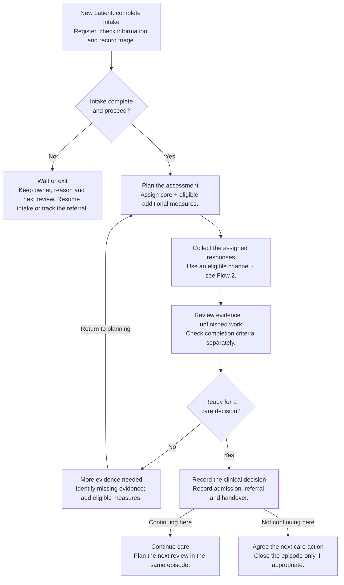
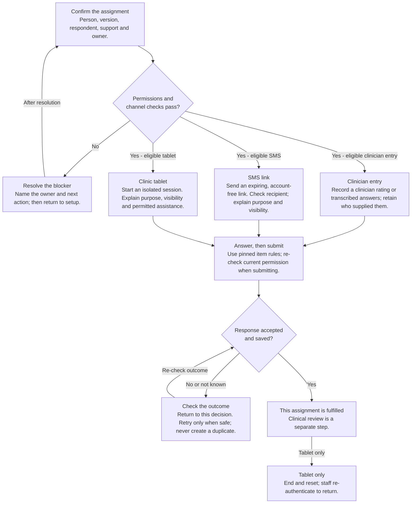
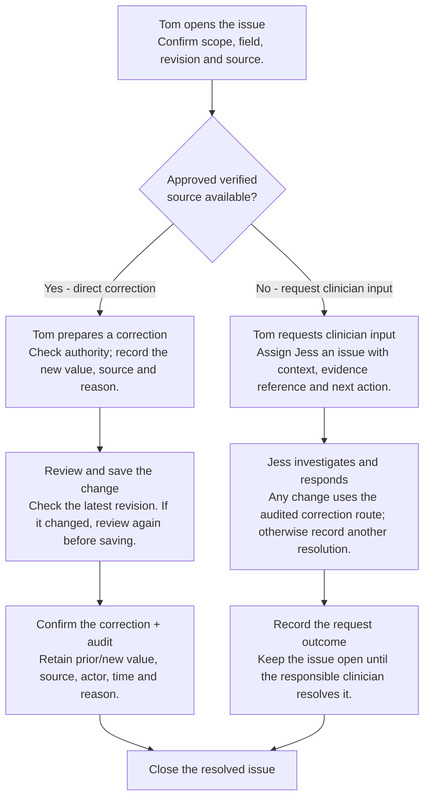

# YSCC Platform - User flows

Executive edition 1.2 | 15 September 2026 | Working proposal

[Visual PDF](../../output/pdf/executive/07-user-flows-executive.pdf) | [Detailed original](../07-user-flows.md) | [Executive index](README.md)

Three decision flows show who acts, where work stops, and where it returns. Boxes are actions; diamonds are questions. These are proposed interaction flows, not approved clinical pathways.

## 1. From intake to next care.

Clinical team | Boxes = actions; diamonds = decisions.

### MANDATORY INTAKE AND NEXT STEPS

Every new patient goes through intake (D-25); registration is not completion. Waiting and non-proceeding intakes retain an owner and next action. Clinical admission remains separate.

Basis: F-01/F-02/F-05/F-08/F-09/F-17; U1/D-25. Intake detail D-26/D-27 remains proposed.

## 2. Three channels. One response.

Staff set up the task; the eligible respondent or clinician completes it.

### PARTICIPATION AND INTERRUPTION

Family contribution does not grant guardian authority or access to another person's answers. A draft is not submitted. Tablet cancel/timeout clears local context under approved policy.

Basis: F-02/F-03/F-04/F-10. Eligibility, recovery and storage policies remain open; phase conflict D-21 remains.

## 3. Correct, or ask the clinician?

Tom, Data Officer | Jess, authorised clinician | Different responsibilities.

### CORRECTION IS NOT A NEW SUBMISSION

Keep the original response submitted and preserve provenance. Do not reissue an invitation or restart ordinary reminders. Source eligibility, re-scoring and re-review still need D-13 approval.

Basis: F-06 / L-20 / AC-05 / AC-18. Cancel leaves the record unchanged. Only authorised actions are permitted.

## 4. Other workflows at a glance.

Supporting processes stay separate from assessment collection.

### Preview before committing

BASELINE / RECORD RESOLUTION

Ananya investigates duplicates or misalignment, records required centre support, previews impact and performs only approved recoverable actions. Suspicion is not identity proof.

### Separate intention from success

BASELINE / CONFIGURATION AND CLOSURE

Configure approved versions. At closure, reconcile pending work and onward referrals. Failed, unanswered or declined referrals retain a YSCC follow-up owner.

### Request, approve, release, learn

CANDIDATE / EVIDENCE USE

Reporting, exchange and research specify purpose and minimum scope, obtain approval, validate and release, then return findings and close use. A request is not an access grant.

### Collection recovery remains part of the design

Expired or wrong-recipient links lead to safe support, not exposed answers. Reissue preserves attempt history. Tablet reset does not decide server-draft retention. Resolve uncertain saves before treating work as submitted.

### GOVERNANCE QUESTION

Who can act, on what evidence, within which scope, and how is the result verified? Require answers before implementing shortcuts or external data access.

Basis: F-07/F-09/F-11 and candidate F-14 to F-16. These summaries do not replace the detailed F-01 to F-17 catalogue.

## What changed in this revision

- Replaced side-note tables and channel lists with explicit decisions, arrows, return paths and outcomes.
- Separated a fulfilled assignment from clinical review, assessment completion and admission.
- Made Tom's verified-source correction route distinct from a request for Jess to investigate.
- Retained supporting operations and candidate evidence workflows on a separate page; the detailed flow catalogue remains authoritative.
